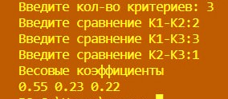
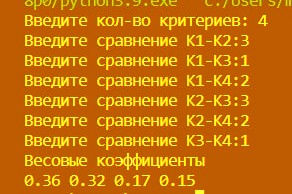

# Lab--6
# Автор программы
Филиппов Кирилл Фт-220007
# Функционал программы
Данная программа основана на Методе Анализа Иерархий (МАИ) Саати, на основе входных данных выводит весовые коэффициенты для каждого критерия
# Запуск программы
Программа может быть открыта в любой среде.
Написана в VScode
# Тесты
Тест 1
___

___
Тест 2
___
